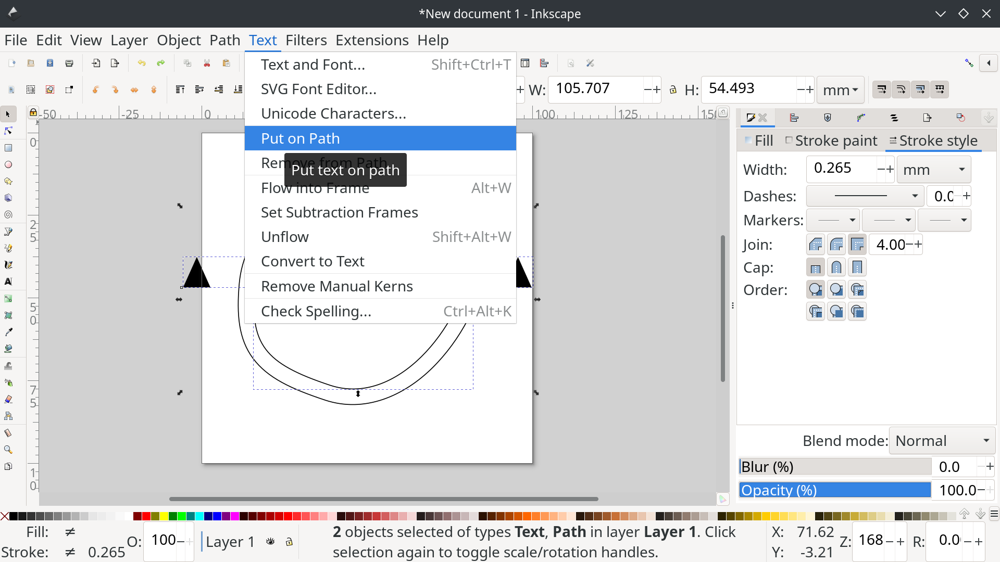

```{r setup, include=FALSE}
knitr::opts_chunk$set(echo = FALSE)
```

# Beispiel 1: Einstiegsschacht

## Umrisse Zeichnen

* Umrisse als Pfad Zeichnen

{#id .class height=50%}

## Zweite Linie Hinzufügen

* Mittels `Path > Linked Offset` 

{#id .class height=50%}

## Offset Einstellen

* Die innere Linie kann nun normal als Pfad bearbeitet werden
* Die äußere Linie hat nur einen "Griff" mit dem der Abstand zur inneren Linie eingestellt werden kann

{#id .class height=50%}

## Abbruchkante 1

* Mit der Schriftart für Abbruchkanten die Symbole als Text hinzufügen (Text "3 3 3"...)
* Pfad und Text Markieren
* Mit `Text > Put on Path` entlang Pfad ausrichten 

{#id .class height=50%}

## Richtung Einstellen

* Falls die Pfeile in die falsche Richtung zeigen mit `Path > Reverse` umdrehen

{#id .class height=50%}

## Fine Tuning

* Linienbreiten der inneren und äußeren Linien einstellen
* Abstand zwischen den Linien Einstellen
* Schriftgröße, Zeichen-Abstand, Wort-Abstand, ... für die Symbole einstellen

{#id .class height=50%}

# Beispiel 2: Raster

## Pfad Effekt Hinzufügen

* Zeichnen einer horizontalen / vertikalen Linie
* Nützlich dazu: 
  * Raster einblenden `#` und Snapping aktivieren
  * Oder beim Zeichen Tool `Strg` gedrückt halten
* Dann Pfad-Effekt "Tiling" hinzufügen

{#id .class height=50%}

## Pfad Effekt Einstellen

* Für horizontale Linien Columns auf 0, für vertikale Rows auf 0
* Gap auf gewünschte Raster-Weite Eistellen
  * Achtung auf Einheiten, absolute Einheiten wie "mm" benützen

{#id .class height=50%}

## Fertig?

* In vielen Fällen reicht es nun das Raster ganz nach hinten zu verschieben (`Pg down` bzw. `Ende`)
* Ggf. kann man einen weißen Hintergrund zwischen Raster und Plan einfügen, damit der Raster nicht am Plan klebt
* Alternativ kann man den Raster manuell weiter bearbeiten (siehe nächste Folien)

## Object to Path

* Zuerst mit `Path > Object to Path` aus dem Pfad Effekt einen neuen Pfad (ohne Effekt erstellen)

{#id .class height=50%}

## Pfad Aufteilen

* Dann mit `Path > break apart` die Linien in einzelne Pfade aufspalten

{#id .class height=50%}

## Pfade bearbeiten 1

* Nun kann man die Pfade bearbeiten, zb. Konten hinzufügen wo der Pfad nachher zerteilt werden soll

{#id .class height=50%}

## Pfade Bearbeiten 2

* z.b. Pfade zerteilen und dann nach außerhalb des Planes verschieben
* `Strg` gedrückt halten um Objekte oder Knoten nur horizontal oder vertikal zu verschieben

{#id .class height=50%}
