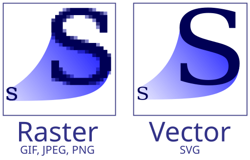
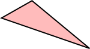
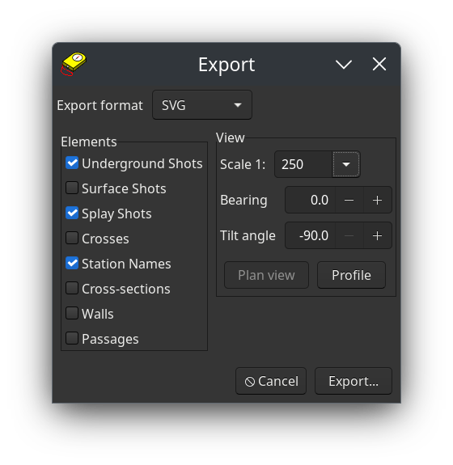

```{r setup, include=FALSE}
knitr::opts_chunk$set(echo = FALSE)
```

# Vorbereitung

## Programme und Vorlagen

### Installation von Inkscape und Aven

* Inkscape (Vektorgrafik)
  * Windows, Mac, Linux Appimage: Download von [https://inkscape.org/release/](https://inkscape.org/release/)
  * Linux über Paket-Manger: das paket heißt auf fast allen Distros `inkscape`
* Survex/Aven (Messdatenverwaltung)
  * Windows, Max, Linux deb-Package, Sourcecode: Download von [https://survex.com/download.html](https://survex.com/download.html)
  * Linux über Paket-Manager: auf Debian verfügbar, Package `survex-aven`
  
  
### Download der Vorlage


* Inkscape Vorlage
   * Download von [https://github.com/TobiasFellinger/SpeleoInkscapeVortrag](https://github.com/TobiasFellinger/SpeleoInkscapeVortrag/raw/refs/heads/main/Vorlage/vorlage_tobi.svg)
* Schriftart für Abbruckanten Symbole
  * Download von [https://github.com/TobiasFellinger/SpeleoInkscapeVortrag](https://github.com/TobiasFellinger/SpeleoInkscapeVortrag/raw/refs/heads/main/Vorlage/Abbrueche1.ttf)
  * Installation
    * Windows: Rechtsclick
    * OSX: Doppelclick
    * Linux: je nach Distribution / Desktop Umgebung
  
## Technische Basics

### Vektorgrafik

* Bild wird nicht als Raster von Farbwerten für jeden Pixel gespeichert
* Formen im Bild werden beschrieben und erst für die Darstellung in Pixelwerte umgerechnet
  * Beim Zoomen nicht verpixelt
  * Fertiges Dokument ist leicht bearbeitbar
  * In den meisten Fällen weniger Speicherbedarf

{#id .class height=25%}

### SVG Dateiformat

* xml-basiertes Vektor-Dateiformat
* offenes Dateiformat mit breiter Unterstützung, Grafik-Programme, Browser, ...
* Je nach Feature besser oder weniger gut (Animation, Filter, ...) unterstützt 

```
<path
   style="fill:#ff0000;stroke:#000000;stroke-width:1;stroke-opacity:1;fill-opacity:0.26666668;"
   d="M 68.520807,58.755454 94.388127,43.985563 143.11607,84.691597 Z" />
```

{#id .class height=25%}

## Daten Konvertieren

### Vermessungs Dateiformate konvertieren

* Therion $\rightarrow$ Survex: 
  * mit Therion  
    in `.thconfig`:  
    `export model -fmt survex -o "dateiname.3d"`
* Survex $\rightarrow$ Therion:  
  * `.3d`-File mit `import` command in `centerline` block importieren  
    Siehe: Anleitung [https://therion.speleo.sk/samples.doc/40.html](https://therion.speleo.sk/samples.doc/40.html)
  * oder händisch konvertieren  
    Siehe Anleitung [https://github.com/tr1813/migresurvey?tab=readme-ov-file#manually-dont-do-this-anymore](https://github.com/tr1813/migresurvey?tab=readme-ov-file#manually-dont-do-this-anymore)
  * python script (nicht getestet)  
    github: Script [https://github.com/tr1813/migresurvey/blob/master/scripts/svx_to_th.py](https://github.com/tr1813/migresurvey/blob/master/scripts/svx_to_th.py)

### Messdaten in Inkscape öffnen

* Survex:
  * `File > Export As > Svg`
  * Einmal Plan und einmal Längsschnitt exportieren  
* Therion:
  * Umweg über Survex
  * oder mit inkscape Addon
    * Installation von [github](https://github.com/speleo3/inkscape-speleo/)
    * Dann in Inkscape die `.th2` Files von Plan und Längsschnitt öffnen

{#id .class height=40%}

# Zeichnen mit Inkscape

## Ebenen und Gruppen

* Reiter `Layers and Objects`
* Sichtbar / Unsichtbar machen
* Für Bearbeitung Sperren / Entsperren
  * Entsperren auch für Kopieren notewendig
* Objete einer Gruppe / Ebene auswählen und gemeinsam bearbeiten

## Allgemeine Zeichen Werkzeuge

### Objekt Werkzeuge

* Transformation (Skalieren/Verschieben/Drehen/Scheren)
* Nach vorne / hinten verschieben `Pg up`/`Pg down`
* Gruppieren / Gruppierung Aufheben
* Clipping und Maskierung setzen / aufheben
  * Vorderes Objekt ist Maske für hinteres

### Pfad-Werkzeuge und Formen

* Polygon
* Bezier-Kurven
* Freihand-Linien
* Splines

### Boolsche-Operationen

* Durchschnitt & Vereinigung
* Verbinden & Aufspalten
* Segmente Einfügen & Löschen

### Weitere Pfad Eigenschaften

* Nodes hinzufügen, entfernen
* Combine & Break Apart

### Pfad Eigenschaften

* Reiter `Fill and Stroke`
* Stile kopieren und einfügen `Strg+Shift+V`

## Symbole

* Reiter `Symbols`
* Hinzufügen und Entfernen (unten im Reiter)

## Effekte und Spezial Tools

### Mit Muster Füllen

* Editieren mit Node Tool
* Hinzufügen und Entfernen mit `Object > Pattern`
* Umbenennen im SVG editor

### Pattern Along Path / live Path Effects

* Reiter `Path Effects`
* `Path > Paste Path Effects`
* Pattern along Path
  * Referenz Objekt Auswählen

### Spray Tool

* Objekte auswählen (z.b. Geröll)
* Einstellungen `Width`, `Ammount`, `Rotation`, `Scale`
* Einstellungen overlap, apply to transparent / non trasparent

## Speichern und Exportieren

* pdf: `File > Save a Copy`
* png: Reiter `Export`